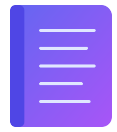

<div align="center">
	<br>
	
	<br>
	<br>
</div>

> Look up contacts by phone number, name, or email from macOS Contacts

Works with any phone number format. Pipe-friendly — enriches [`imsg`](https://github.com/nicholasgetz/imsg) history in place.

## Install

### Homebrew

```sh
brew install karbassi/tap/apple-contacts-cli
```

### From release

```sh
VERSION=$(gh release view --repo karbassi/apple-contacts-cli --json tagName -q .tagName)
curl -L "https://github.com/karbassi/apple-contacts-cli/releases/download/${VERSION}/apple-contacts-cli-${VERSION}-macos-universal.tar.gz" | tar xz
mv apple-contacts-cli /usr/local/bin/
```

### From source

```sh
git clone https://github.com/karbassi/apple-contacts-cli
cd apple-contacts-cli
swift build -c release
cp .build/release/apple-contacts-cli /usr/local/bin/
```

## Usage

```
$ apple-contacts-cli --help

OVERVIEW: Look up contacts by phone number, name, or email from macOS Contacts.

Phone lookup is the default. Use --name or --email to search by other fields.
Use --enrich to pipe NDJSON from `imsg history --json` via stdin.

USAGE: apple-contacts-cli [<queries> ...] [--name] [--email] [--enrich] [--format <format>]

ARGUMENTS:
  <queries>               Queries to look up. Phone numbers by default; use
                          --name or --email to change.

OPTIONS:
  --name                  Search by contact name.
  --email                 Search by email address.
  --enrich                Read NDJSON from stdin and enrich sender/participants
                          with contact names.
  --format <format>       Output format: json (default), ndjson (one object per
                          line), or text (tab-separated). (default: json)
  -h, --help              Show help information.
```

### Examples

```sh
apple-contacts-cli +14155551212 +16505551234
apple-contacts-cli --format text +14155551212
apple-contacts-cli --format ndjson +14155551212 +16505551234
apple-contacts-cli --name "Jane Doe"
apple-contacts-cli --email jane@example.com
imsg history --chat-id 215 --json | apple-contacts-cli --enrich
imsg history --chat-id 215 --json | apple-contacts-cli --enrich --format text
```

## Phone number formats

All of the following resolve to the same contact:

```
+16085551212
16085551212
6085551212
+1 (608) 555-1212
(608) 555-1212
608-555-1212
608.555.1212
```

Matching is done via `CNPhoneNumber` suffix matching. Partial suffixes work — `555-1212` will match if unambiguous. Prefix-only fragments (e.g. just an area code) do not match.

## Output formats

| Mode | Flag | Output |
|------|------|--------|
| Lookup | `--format json` (default) | Pretty-printed JSON array of contact objects |
| Lookup | `--format ndjson` | One JSON object per line, ideal for streaming and piping |
| Lookup | `--format text` | `query\tname` one line per result (tab-separated) |
| Enrich | `--enrich` | NDJSON passthrough with `sender`/`participants` replaced by names |
| Enrich | `--enrich --format text` | `sender\ttext` tab-separated lines |

## Permissions

On first run, macOS prompts for Contacts access. Grant it via:

**System Settings → Privacy & Security → Contacts → apple-contacts-cli ✓**

If the prompt never appears (SSH session, cron, etc.) and you see:

```
error: contacts access denied.
```

Run the binary once interactively from Terminal to register it with TCC, then grant access in Settings.

## Related

- [imsg](https://github.com/nicholasgetz/imsg) - Read iMessage history from the terminal
